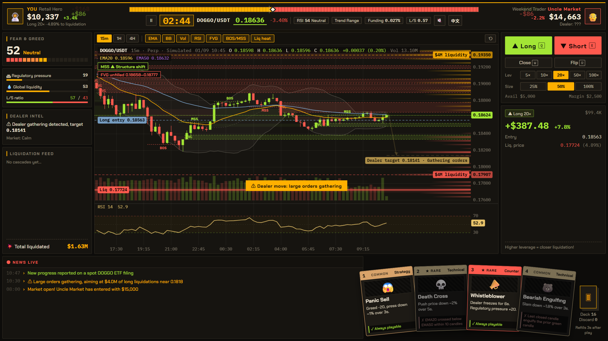
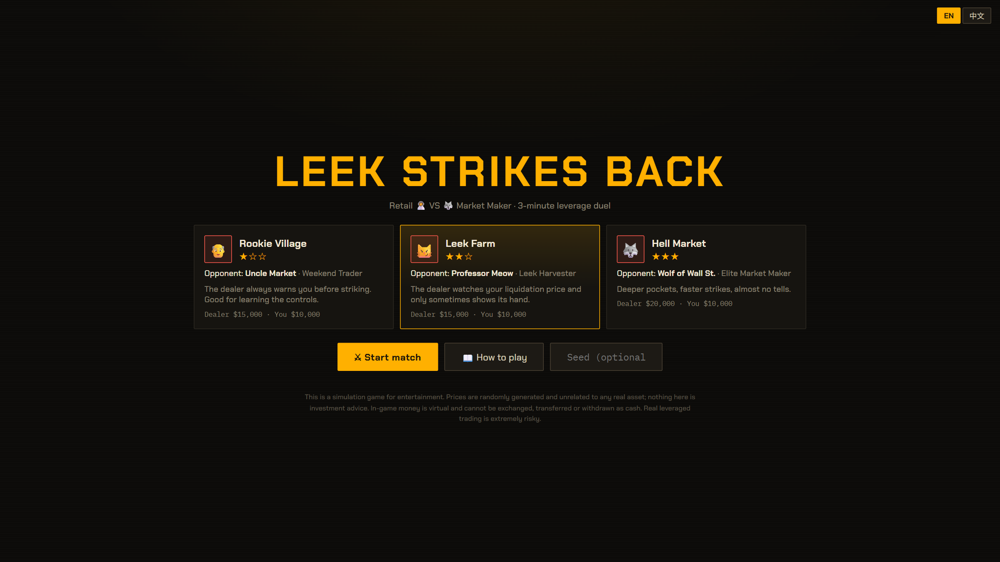

# Leek Strikes Back · Crypto Trading Game (韭菜反擊戰)

An open-source **crypto trading game** and leverage trading simulator in the browser: a 3-minute duel where you (a retail trader) fight an AI market maker on a fully simulated market. Built with React + TypeScript.



<details>
<summary>Main menu</summary>



</details>

- **Simulated market**: a seeded price engine (GBM + volatility regimes + jumps), a crowd of retail traders whose liquidation levels pile up into liquidity zones, and cascading liquidations.
- **Market maker AI**: a state machine that hunts liquidity, including *your* liquidation price. It telegraphs its moves, so a player who reads the chart can dodge or counter.
- **Trading**: long / short / close / flip, 5×–100× leverage, isolated margin with realistic liquidation prices, funding, fees and slippage.
- **Cards**: 17 technical-analysis, defense, intel and counter cards. Technical cards only work when the chart setup is really there (golden cross, RSI oversold, engulfing…).
- **Chart**: candlesticks (15m / 1H / 4H), EMA, Bollinger, volume, RSI, FVG, BOS/MSS and a liquidation heat map, drawn on canvas.
- **English and Traditional Chinese** UI (English by default; toggle in the menu or the in-game HUD).

> Entertainment only. Prices are randomly generated and unrelated to any real asset; nothing here is investment advice. In-game money is virtual and cannot be exchanged for cash.

## Run

```bash
npm install
npm run dev       # http://localhost:5173
npm test          # engine + i18n unit tests
npm run build     # production build in dist/
npm run sim       # balance report: bots across difficulties and leverage
```

### Controls

| Key | Action |
| --- | --- |
| Q / E | Long / Short |
| W / R | Close / Flip |
| 1–4 | Play card |
| Space | Pause |
| ` | Debug panel (dealer state, speed) |

Chart: mouse wheel to zoom, drag to pan, double-click to reset.

## Project layout

```
src/
  engine/     pure TypeScript game logic, no React (market, crowd, dealer AI, cards, match)
  i18n/       en / zh dictionaries; the engine emits message keys, the UI translates
  store/      Zustand store (settings, match instance, UI effects)
  ui/         React components: chart renderer, HUD, order panel, cards, dashboard
```

The engine is deterministic for a given seed, so a match can be replayed ("Same market again") and could later run server-side for PvP or anti-cheat.

## Tech

Vite · React 18 · TypeScript · Zustand · Canvas 2D · Vitest
